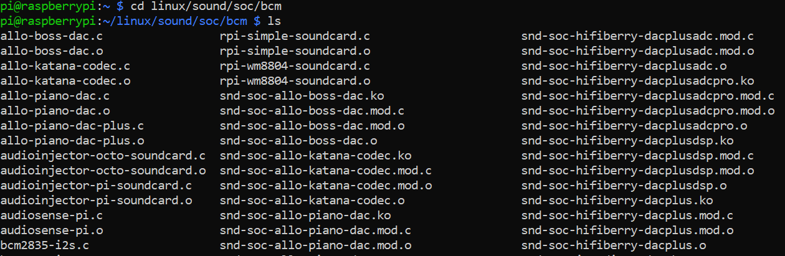
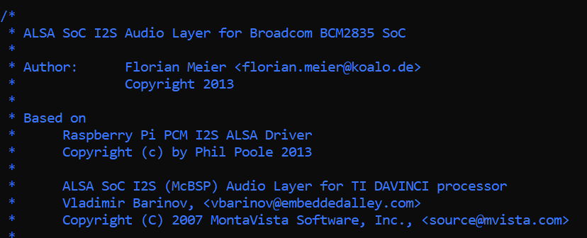
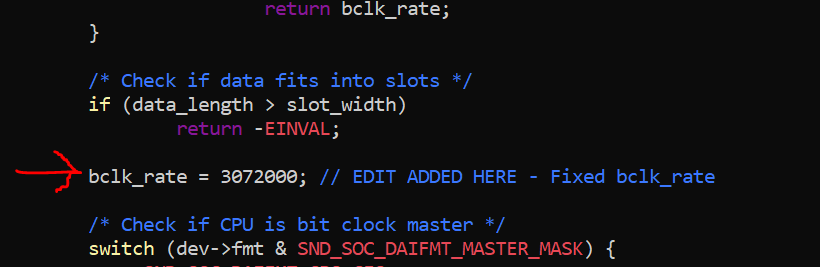
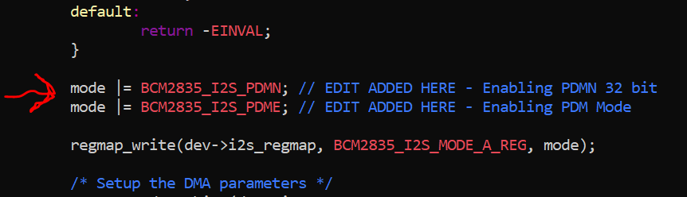
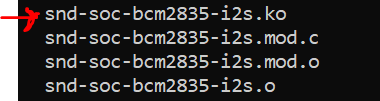

## Raspberry Pi Zero W PDM Mode Setup

<b> Note as of 16/05/2021, the following instructions have also been tested on the Raspberry Pi 4 Model B and successfully enables PDM audio </b> 

<b> RPi version: 4.19.88+ </b>

<b> Relevant links: </b>
 - https://www.raspberrypi.org/forums/search.php?keywords=PDM&t=8496&sf=msgonly&sid=a73abb9ffda45a271f6cb82d554a9aa5
 - https://github.com/imec-int/Raspberry-Pi-Installer-Scripts

The RPi's SoC (BCM2835) is not configured to take PDM data as an input on its I2S line, however it is capable of interfacing with 2 PDM microphones. To enable PDM input, these are the specific steps that I followed:

Navigate to the BCM2835 sound source file (bcm2835-i2s.c) location by doing the following:
 
```bash
cd linux/sound/soc/bcm
```



Open the BCM2835 I2S sound source file for editing in root mode

```bash
sudo nano bcm2835-i2s.c
```



Make the following edits in the sound source file to ensure PDM is enabled correctly - here we are using bitwise OR to write 1 to the relevant PDM registers which you can find in the BCM2835 SOC datasheet:
 - Go to line ~393/394 and write "bclk_rate = 307200" (This fixes the PCM clockrate at 3.072 MHz which is what we generally need for PDM microphones - note this may be unique for different microphones, check your relevant datasheet)
 - Go to line ~586 and write "mode |= BCM2835_I2S_PDMN;" on one line and "mode |= BCM2835_I2S_PDME" on the next line. Note this should be done before the existing command in the file "regmap_write(dev->i2s_regmap, BCM2835_I2S_MODE_A_REG, mode);" (This enables PDM mode and selects a decimation factor of N = 32)
 
Be sure to save the changes made to the sound source file.  






Now that we have changed the source file, we use the 'make' command to run the MakeFile which compiles all changes and generates a .ko kernel object:
    
```bash
make -C /lib/modules/(\\$ uname -r)/build M=(\$ pwd)
```

You should see a bunch of files with .c, .o and .ko extensions - look out for the file named `snd-soc-bcm2835-i2s.ko`. This is the file which captures changes made in the `bcm2835-i2s.c` file.



Now we have to navigate to the directory of the kernel which contains the existing "snd-soc-bcm2835-i2s.ko" which needs to be replaced. Once we are there, we need to remove the existing kernel object so we can replace it with the newly generated one:

```bash
cd lib/modules/(uname -r)/kernel/sound/soc/bcm

sudo rm -r snd-soc-bcm2835-i2s.ko
```


Now we navigate back to the location of our <b> new </b> "snd-soc-bcm2835-i2s.ko" kernel object and copy this over to the kernel directory in which we have just deleted the existing sound kernel object:

```bash
sudo cp snd-soc-bcm2835-i2s.ko /lib/modules/($ uname -r)/kernel/sound/soc/bcm
```


Reboot the pi and test your PDM audio recording using the `arecord` command.

